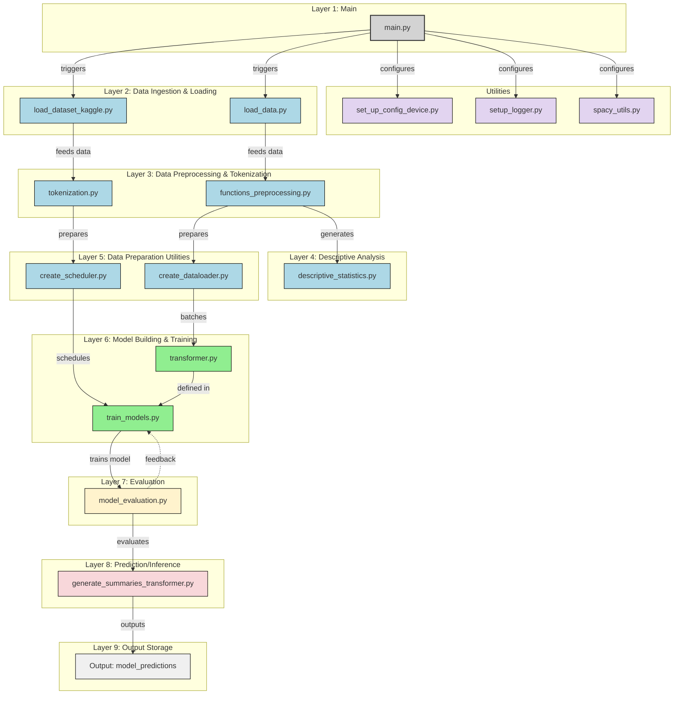

# Transformer Exploration for News Summarization :newspaper:

This project explores Transformer-based models inspired by the paper [*Attention Is All You Need*](https://arxiv.org/abs/1706.03762). We use a Transformer model for **news article summarization** using the [Kaggle News Summarization dataset](https://www.kaggle.com/datasets/sbhatti/news-summarization):

---

## How to use the code

The code for this project is available in a modular format. All utility functions are organized into `.py` files and the main.py combines them all.

Here’s how you can use the repository:

1. **Clone the repository and install requirements** :
```
git clone https://github.com/pafruchtenreich/ml-project-transformers-mlops.git
cd ml-project-transformers-mlops
pip install -r requirements.txt
```

2. **First run**:

You'll need to download the data from scratch and you may want to retrain the model.
```
python main.py --reload_data True --retrain_model True
```
You can as well choose to use the weights saved in the S3, you can use these to generate summaries without retraining.
```
python main.py --reload_data True
```
3. **Subsequent runs** : The data and the weights are now saved so the following command is enough
```
python main.py
```
This will load the trained model, load locally saved and preprocessed data, run inference and compute the metrics.

### 🚀 Launching the API Locally

To run the FastAPI-based news summarization API on your local machine, place yourself in the root directory and run :

1. **Launch the FastAPI server:**
   ```bash
   uvicorn src.app.api:app --reload

This will start the API at `http://127.0.0.1:8000` and you will be able to paste your article and get a summary.
The POST endpoint is : `/summarize`

### 🐳 Docker Deployment

To deploy the project using Docker, follow these steps:

1. **Build the Docker image:**

   ```bash
   docker build -t news-summarization .

2. **Run the container:**
   
   ```bash
   docker run -p 8000:8000 news-summarization

This will automatically create the required environment, run `main.py` and launch the API service, via the files `Dockerfile` and `src/app/run.sh`.

---

## Results and Experiments

When fully trained, a very similar model yields the following performances :

| Model                        | ROUGE-1 | ROUGE-2 | ROUGE-L | Train Time (ep)  | Params  |
|------------------------------|---------|---------|---------|------------------|---------|
| Transformer                  | 0.20    | 0.04    | 0.15    | ~ $1.6 \times 10^4$ s (25) | $1.25 \times 10^7$  |

The model was trained on an NVIDIA A100 GPU with 40 GB of high-bandwidth memory. :computer:

---

## Repository structure




## Contributing

Contributions are welcome! Please feel free to submit a Pull Request.

## License

MIT

## References

Inspired by the original *Attention is all you need* paper [1] and implementation.

[1] A. Vaswani, N. Shazeer, N. Parmar, J. Uszkoreit, L. Jones, A. N. Gomez, L. Kaiser, I. Polosukhin, [*Attention Is All You Need*](https://arxiv.org/abs/1706.03762)

```
@misc{vaswani2023attentionneed,
      title={Attention Is All You Need},
      author={Ashish Vaswani and Noam Shazeer and Niki Parmar and Jakob Uszkoreit and Llion Jones and Aidan N. Gomez and Lukasz Kaiser and Illia Polosukhin},
      year={2023},
      eprint={1706.03762},
      archivePrefix={arXiv},
      primaryClass={cs.CL},
      url={https://arxiv.org/abs/1706.03762},
}
```
